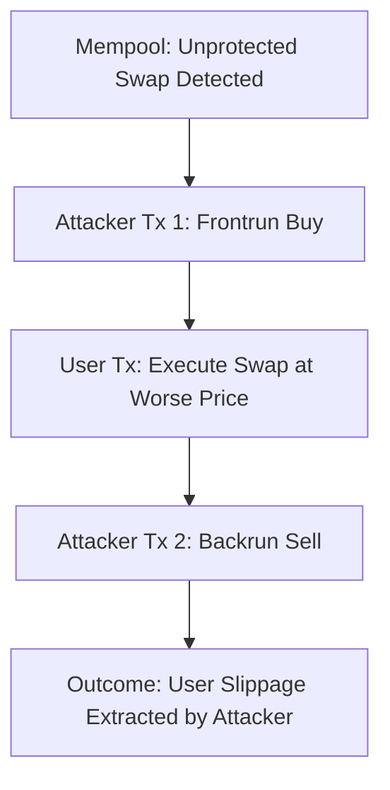

# Practical Implementation Plan: PreSend Adaptive Decision Guard Framework (PADGF)

This document outlines the **completed practical implementation** for Phase 1 of the PreSend Adaptive Decision Guard Framework (PADGF) and establishes the step-by-step roadmap for subsequent phases (Phase 2 to Phase 4) in mitigating sandwich attacks on decentralized exchanges.

---

## 1. Executive Summary & Objective

The **PreSend Adaptive Decision Guard Framework (PADGF)** is designed to protect decentralized exchange (DEX) transactions from predatory MEV (Maximal Extractable Value) strategies—specifically sandwich attacks. 

To prove its efficacy, we are building a prototype in four distinct phases:
1. **Phase 1: Baseline Ground Truth Environment** (Completed)
2. **Phase 2: Sandwich Attacker Simulation** (Pending)
3. **Phase 3: Adaptive Decision Guard (PADGF) Logic** (Pending)
4. **Phase 4: Evaluation and Academic Integration** (Pending)

---

## 2. Phase 1: Completed Practical Work (The Ground Truth)

We have built a deterministic testing environment to act as the "ground truth" (control group) for all simulations.

### A. Environment & Dependency Setup
* **Runtime**: Configured Node.js v20.12.2 environment.
* **Smart Contract Framework**: Integrated **Hardhat (v2.22.17)** with `@nomicfoundation/hardhat-toolbox (v5.0.0)` and **Ethers.js (v6.16.0)**.
* **Configured Environment Variables**: Isolated API credentials (using `dotenv`) for secure access to Ethereum nodes.

### B. Deterministic Mainnet Forking
* **Target Block Pinning**: Configured Hardhat to fork the Ethereum Mainnet at block **`19400000`**.
* **Rationale**: Pinning the block ensures that all smart contract states, pool reserves (WETH/USDC on Uniswap V2), and token balances are identical across every run. This eliminates network latency and state drift, providing a strictly reproducible baseline.

```javascript
// hardhat.config.js
hardhat: {
  forking: {
    url: process.env.MAINNET_RPC_URL,
    blockNumber: 19400000
  }
}
```

### C. Baseline Transaction Simulation (`scripts/baseline-swap.js`)
* **Account Impersonation**: Impersonated a high-balance whale address (`0x28C6c06298d514Db089934071355E5743bf21d60`) on the local fork to simulate significant trade volumes.
* **Gas Funding**: Seeded the impersonated signer with **10 ETH** via local Hardhat provider calls to ensure gas limits do not fail the transaction.
* **Uniswap V2 Interaction**:
  - Target pair: **WETH** (`0xC02a...6Cc2`) to **USDC** (`0xA0b8...B448`).
  - Fetched live quotes using the Uniswap V2 Router's `getAmountsOut` function.
  - Executed a `swapExactTokensForTokens` transaction for **1.0 WETH** with a standard **1% slippage tolerance**.
* **Metrics Extraction**: The script captures and returns a structured JSON payload detailing:
  - `expected_output` (Uniswap query)
  - `actual_output` (tokens transferred)
  - `gas_used`
  - `transaction_hash`

### D. User Interface (`interface/cli.js`)

* Built an interactive terminal menu using Node's `readline` library.
* Allows the user to trigger the baseline swap programmatically, executing Hardhat tasks and returning clean performance metrics to the console.

### E. Execution & Reproducibility

To ensure perfect replication of the baseline scenario:

* **Fork the Mainnet (Terminal 1):** `npx hardhat node`
* **Execute CLI (Terminal 2):** `node interface/cli.js`
* **Or run the script directly:** `npx hardhat run scripts/baseline-swap.js --network localhost`

**Reproducibility Checklist:**

* [x] Node.js Version: `v20.12.2`
* [x] Hardhat Version: `v2.22.17`
* [x] Ethers.js Version: `v6.16.0`
* [x] Fork Block: `19400000` (Ethereum Mainnet)
* [x] Token Pair: `WETH` -> `USDC`
* [x] DEX: `Uniswap V2`
* [x] Input Amount: `1.0 WETH`
* [x] Slippage Tolerance: `1%`

---

## 3. Phase 2: Sandwich Attacker Simulation (Completed)

The next step is to construct an adversarial bot to simulate how sandwich attacks exploit the baseline transaction.



### Completed Tasks:
- [x] **Mempool Monitoring**: Read the pending baseline transaction parameters to execute a front-run.
- [x] **Frontrun Action (Tx 1)**: The attacker executes a massive buy transaction (WETH → USDC) just before the user's transaction, driving up the price of USDC.
- [x] **User Transaction Execution**: The user's transaction is executed at a higher price, suffering slippage but completing within their 1% tolerance.
- [x] **Backrun Action (Tx 2)**: The attacker immediately sells the USDC acquired in Tx 1 back for WETH (USDC → WETH) at the inflated price.
- [x] **Metrics Captured**:
   - Total USDC successfully extracted/stolen from the user.
   - Total gas costs incurred by the attacker to launch the sequence.
   - Outputs saved sequentially to JSON and CSV formats for analysis.

---

## 4. Phase 3: PreSend Adaptive Decision Guard (PADGF) Implementation (Completed)

Here, we developed the active defense mechanism that evaluates transactions before submission based on simulated transaction parameters.

### Completed Features:
- [x] **Pre-Broadcast Simulation**: Simulate the expected reference quote and compare it with the current state execution block before the transaction enters the public mempool.
- [x] **Risk Evaluator**: Compute algorithmic risk metrics using slippage deviation, gas sensitivity, and a price impact proxy.
- [x] **Decision Engine**: Automatically determine execution viability based on dynamically normalized risk thresholds ($R = w_1S + w_2P + w_3G$). Decides whether to Execute, Delay, or Block.
- [x] **Result Aggregation**: Produces Supervisor-ready reports in JSON, CSV, and Markdown to demonstrate that the transaction exhibits high-risk execution characteristics associated with sandwich attack exposure (if present) before submission.
- *Note: PADGF provides a pre-broadcast risk evaluation and decision framework, not a guarantee of MEV prevention.*

---

## 5. Phase 4: Comparative Evaluation and Thesis Integration

We will run a series of automated trials comparing the scenarios:

| Metric | Scenario A: Baseline (Unprotected) | Scenario B: Attacked (No Guard) | Scenario C: Protected (With PADGF) |
| :--- | :---: | :---: | :---: |
| **Actual Output (USDC)** | Maximum / Fair | Low (Slippage Exploited) | Near-Maximum (Protected) |
| **Total Gas Used** | Standard (~120k) | Standard (~120k) | Variable (Dynamic Gas or Routing) |
| **Attacker Profit** | $0.00 | High (Extracted) | $0.00 (Failed / Avoided Attack) |
| **Transaction Status** | Success | Success (but poor rate) | Success / Safe Re-route |

### Deliverables:
* **Consolidated Data Reports**: CSV/JSON files containing metrics over 50 test iterations at varying block states.
* **Academic Graphs**: Plotting slippage extraction vs. protection overhead.
* **Thesis Section Drafts**: Providing empirical data for the "Results and Discussion" chapter of the research thesis.
